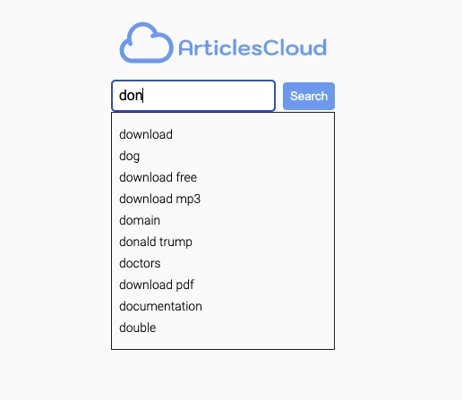
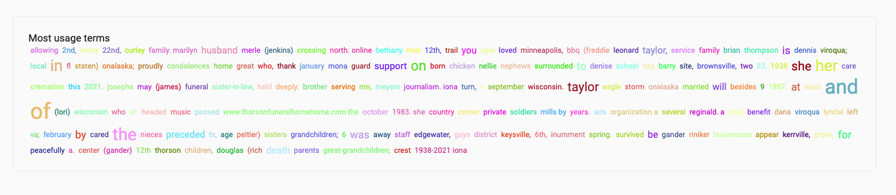

<h1 align="center"> Web Search Articles</h1>

<p align="center">
	
</p>
<p  align="center">This is a page where users can search for news articles about topics of interest</p>
<p align="center"><a href="https://articles-web-search.vercel.app/">Access the sample website</a></p>

<br />
<hr />
<br />

<h2> Features </h2>
<h3> Recommendation terms</h3>
<p>After write three or more letters you can see some recommendation terms</p>
<p>
	
</p>

<br />
<h3>Most usage words in article</h3>
<p>The application gets the boddy, counts and separate each no-repeated word and add to React-tagcloud</p>
<p>
	
</p>
<hr />


<h2>Dependences</h2>
<ul>
	<li>Next.js</li>
	<li>Tylescript</li>
	<li>React Context-api</li>
	<li>Styled-components</li>
	<li>Jest</li>
	<li>Storybook</li>
	<li>Eslint, Prettier && babel</li>
</ul>


<br />
<h2>Getting Started</h2>

<h3>Clone the repository</h3>

```bash
git clone https://github.com/massaaki/articles-web-search
```

<h3>Access the project and intall dependences</h3>

```bash
cd articles-web-search
yarn
```

<h3>Start the server</h3>
<p>Your application will be run on port 3000</p>

```bash
yarn dev
```

<h3>Generating build to production</h3>

```bash
yarn build
```

<h3>Starting Storybook</h3>
<p>Storybook will be run on port 6006</p>

```bash
yarn storybook
```
